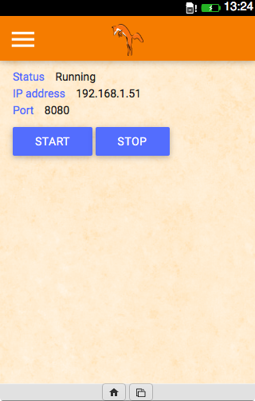

# SMSFox 
Firefox OS application to serve as a web relay to send messages.

## Initial objectives
* Mastering the entire compilation process of applications under Firefox OS
* Understanding the native SMS application of Firefox OS
* Developping a secure website which can send SMS through the application
* Communicating with connected objects
* ...

## How to make it work ?
#### Cloning the repository
```batchfile
$ git clone https://github.com/FoxHoundAlphaUnit/SMSFox.git SMSFox
$ cd SMSFox
```

## Automatic building
You can launch the update.sh script which will transform and minify the necessary files but you have to install sass and the minifier or it won't work.
```batchfile
$ ./update.sh
```

## Manual building
#### Compiling SASS
You'll have to compile the SASS file from css/app.sass to css/app.css.
So, first, if you don't have SASS installed, install the Gem (you must have Ruby installed on your machine):
```batchfile
$ gem install sass
```
Then, to compile the file:
```batchfile
$ sass css/app.sass > css/app.css
```

#### Minifying
First, if you don't have a tool to minify, install one. For example, minifier (you must have NodeJS and the NodeJS package manager installed):
```batchfile
$ npm install -g minifier
```

Then, minify all the app css and js files:
```batchfile
$ minify css/app.css
$ minify css/libs/materialize.css
$ minify js/app.js
```

#### Web IDE
Finally, you can load the app into an emulator or your own Firefox OS phone using WebIDE (available in the Firefox browser, Tools/Web Developer/Web IDE) and it should work!


#### Web Server
Now, if you want to setup the local server, you have to start the web server by accessing it through the Server tab and click on the "Start" button. The IP address of your mobile phone and the port the server is listening to are both displayed on the page.
If everything is working properly, you can now connect to the server on the local network via http://ipaddress:port, for instance, http://192.168.1.90:8080. You should see an "Hello world" page.

 

Then, if you want to make it available on the internet. You got plenty of ways to do it, one could be by using NAT (Network Address Translation) so it becomes available via your public IP address on a specific port.
